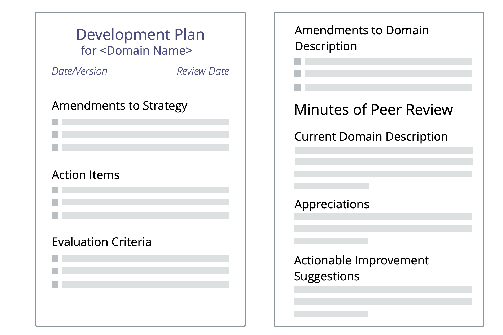

**A plan for how to develop more effective ways of accounting for a domain, agreed between delegator and delegatee.**

The development plan may be created for a person in a role, or for a team (e.g. a department, [circle](circle.html) or [open team](open-team.html)).

Development may happen in the form of refining the [description of the driver](describe-organizational-drivers.html) and the <dfn data-info="Domain: A distinct area of influence, activity and decision making within an organization.">domain</dfn>, making amendments to <dfn data-info="Strategy: A high level approach for how people will create value to successfully account for a domain.">strategy</dfn>, or new or updated agreements and specific actions to be taken, either within the domain of the delegator, or the domain of the delegatee.

A development plan (and any accompanying recommendations for changes to the descriptions of the domain and the <dfn data-info="Driver: A person’s or a group&#x27;s motive for responding to a specific situation.">driver</dfn>) requires consent from both the <dfn data-info="Delegatee: An individual or group accepting responsibility for a domain delegated to them, becoming a role keeper or a team.">delegatee</dfn> and the <dfn data-info="Delegator: An individual or group delegating responsibility for a domain to other(s).">delegator</dfn>.

<a href="peer-review.html" title="Back to: Peer Review">◀</a> <a href="peer-development.html" title="Up: Peer Development">▲</a> <a href="enablers-of-collaboration.html" title="Read next: Enablers of Collaboration">▶ Read next: Enablers of Collaboration</a>

